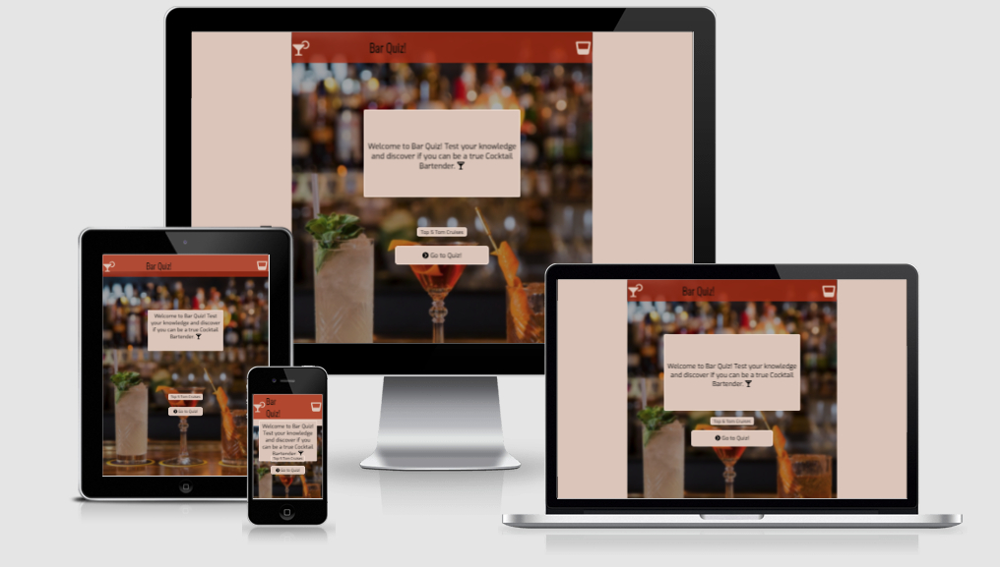
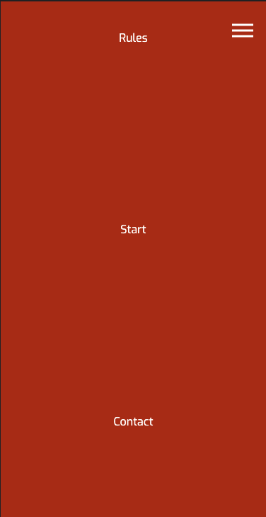
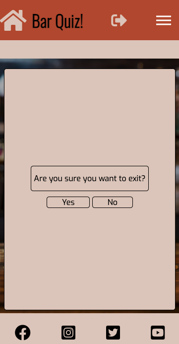
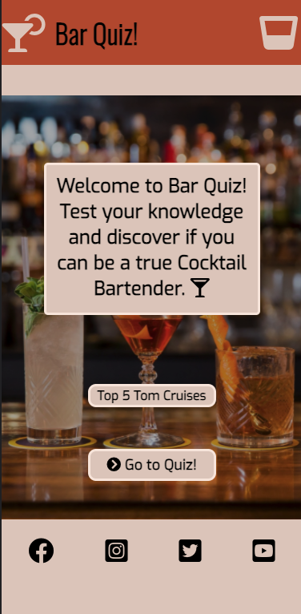
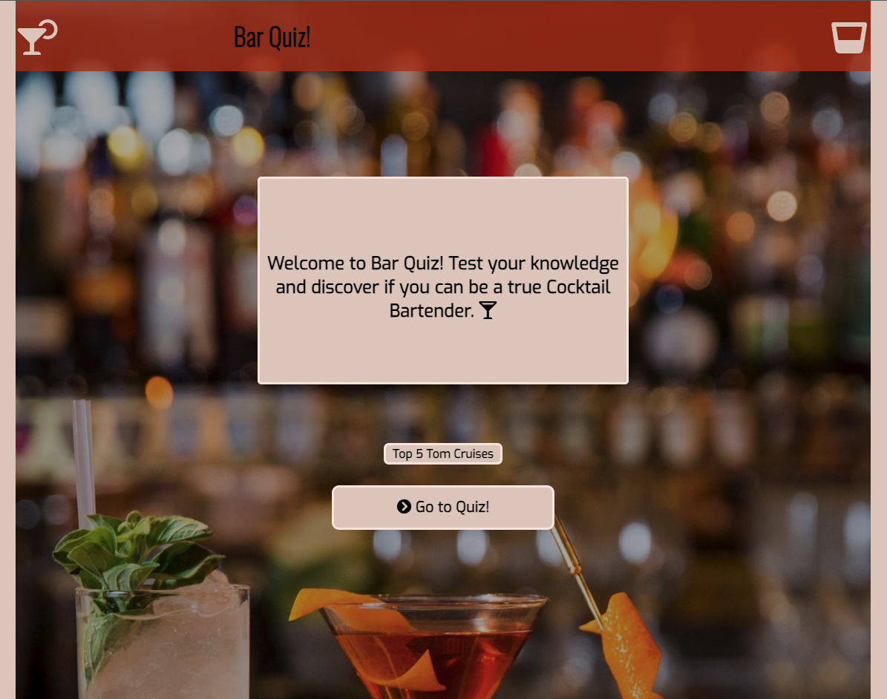
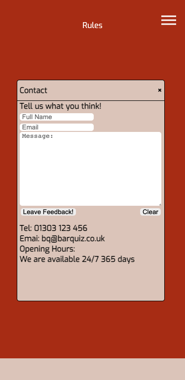
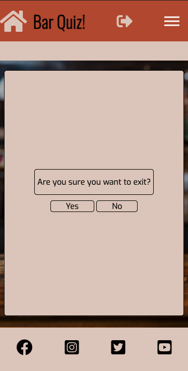
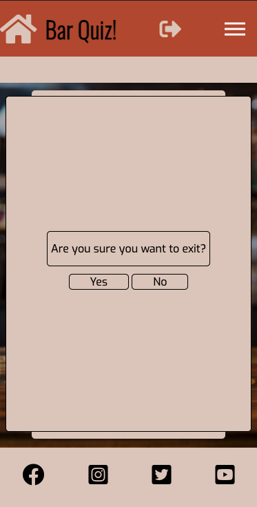

# Welcome to Bar Quiz Website

## Introduction

Bar Quiz is an interractive werbsite designed to engage with users and test their general knowlege on what the classic cocktails are made of.

  

# <a name="top">Table of Contents</a>

### [1. User Experience](#user-ex) 
- User Expectations
- Design Approach
- Returning Users
### [2. Features](#features)
- Navigation Bar
- Home Page
- Quiz Page
- End Page
- Leaderboard Page
- Social Media Links
- Rules Window
- Contact Window
### [3. Wireframe](#wireframe)
### [4. Deployment](#deployment)
### [5. Manual Testing](#manual-testing)
### [6. Technologies Used](#tech-used)
### [7. Bugs](#bugs)
### [8. Credits](#credits)

  
[Top of the page](#top)

## <a name="user-ex">1. User Experience</a>

### User Expectations
The main goal of this quiz is to establish if users know what a classick cocktail is made of. At the end of each quiz users will be given a score and compare themselvs against other users.  

### A new user:
A user visiting the page for the first time will be able to understand what to do and be able to navigate the page with ease.   

### A returning user:
A returning user will be able to jump directly to the Leaderboard on the main page and see what the top score is before starting the quiz themselves.   

### A frequesnt user:
A frequesnt user would want to knwo of any n ew questions have been added to the quiz and compare scores(localy).

  

### Design Approach

## <a name="features">2. Features</a>
[Top of the page](#top)
### Navigation 

- The navigation bar has four different versions depending on which page the user is on, and on what size screen the user is using. 

Mobile Home Page  

Mobile Quiz Page 

Mobile Overlay Effect when pressing the menu 

Mobile Exit Button With Window  

 
User can decide if they wish to exit the page they are in by clicking the exit button. This will take them to the main home page.
  

Mobile Leaderboard and End Page  

 
The reason why no menu option is offered here is because the user has the options presented to them in the Leaderboard page as a button. 

Big Screen Quiz Page

In screens bigger than 500px the nav bar menu has a animation effect where text increases size and changes colour. 
  

### Home Page
 

Both Mobile and Desktop consit in having the following:
-  Header with the title of the website. 
- An introduction box with a brief description. 
- A link to the highest score users under the button "Top 5 Tom Cruises". 
- A "Go to Quiz" button which will take the user to the quiz page.
- A footer containing four social media links which open in individual pages 
 
Mobile 

 

Desktop 

  

### Quiz Page

Both Mobile and Desktop contain similar features such as a description box with the rules of the quiz, a button which allows the user to take the test and the footer with the social media links. There a re a few differences between Mobile and Desktop.

Mobile  

 
In the mobile version a menu bar appears on the right top corner of the page. This allows top user to see the 3 different options presented to them via an overlay animation effect. These 3 options are:
- Rules
    - When clicked a popup window appears with the rules of the quiz.
    - To exit the window the user can click the X symbol. 
      
 
- Start 
    - The user can start the quiz from here as well. 
    - The quiz can be closed via the X button but no warning will be shown here.
  
 
- Contact
    - The user can open the contact window and enter any feedback.
    - The contact window can be close via the X button. 
  
  
Desktop  
In the desktop version the hamburger menu has now disapeared and been replaced with 3 navigation links that animate when the page first loads. The links have the same functions as in the mobile version with the exception of the cursor being a pointer and a hover effect.  
  

- Exit Button 
Both in Mobile and desktop the exit button appears if the user presses the symbol. If the user chooses "Yes" then the home page will relload. If the user chooses "No" then the window will close and the user can carry on. 
  

The Quiz  
Mobile Version  
When the user clickes "Take Test" button the below window will appear.  
The user will then be presented with a question and four options. If the user clickes the correct answer then the question will highlight green, the Score will increase by 100 points and the next question will load.  
If the usser selects the wrong answer then no point will be assigned, the next question will load and the answer will turn red.  
If the user decides to close the quiz window then they can choose to do so by clicking the X button, however the quiz will still be were it was left if the user then decised to carry on with the quiz just by simply clicking "Take Test" again and the quiz will reappear.  
If the user wishes to exit at any stage then they can press the exit symbol. At this stage the page will reload and the progress will be lost.
 
 

At the end of the quiz 
[Top of the page](#top)

### Header 

[Top of the page](#top)

### External Links Section 

  

[Index](#top)

### Visit Folkestone Video 

  

[Index](#top)

## Footer  

  

[Top of the page](#top)

### Town Tour

  

[Index](#top)

### Contact

  

[Index](#top)

### <a name="wireframe">3. Website Wireframe</a>

Mobile 

Tablet

Web Browser

  

[Index](#top)

### <a name="manual-testing">4. Manual Testing</a>

TEST | ACTION | RESULT |
-----|:--------:|--------|
Landing Page | Clicking on the Logo, Title, and Main Picture banner will redirect to the main landing page. Clicking on the video will play with no issues. All other links in the landing page will redirect the user to external pages. All links work correctly.| PASS
Town Tour Page | Clicking "Town Tour" tab in the nav bar will redirect you to the second page of the website. Should the user wish to return to the Landing Page then this can be achieved by clicking the picture logo or Visit Folkestone title. All images have been tested, and will redirect the user successfully to external pages. | PASS
Contact Page | Clicking "Contact" tab in the nav bar will redirect you to the third page of the website. Should the user wish to return to the Landing Page then this can be achieved by clicking the picture logo or Visit Folkestone title. The submission form will send the information successfully to https://formdump.codeinstitute.net/ . The google maps interractive map also works successfully. | PASS
Text | All fonts and colours have been consistent throughout the website | PASS
Footer | The footer contains four social media icons. It is found on all three pages in the exact location on each page. The four social media icons are: Facebook, Instagram, Youtube, Twitter which when clicked, will redirect the user to their respective website. This will work on all three pages. | PASS

- Chrome Developer Tools Lighthouse. The Performance is in the amber zone due the the picture sizes. Visit Folkestone is a website designed to attract visitors so the aim is for the pictures to be as clear and high definition as possible to entice people to come over. The Website still performes well.

- W3C Validator Index Page.

- W3C Validator Town Tour Page.

- W3C Validator Contact Page.

- Jigsaw Validator.

  

[Index](#top)

### <a name="tech-used">5. Technologies Used</a>

- [HTML5](https://en.wikipedia.org/wiki/HTML5) HyperText Markup Language.
- [CSS3](https://en.wikipedia.org/wiki/CSS) Cascade Style Sheets.
- [GitHub](https://github.com/) is used to store the project by commiting changes and pushing them via a terminal.
- [GitPod](https://www.gitpod.io/) is used to code the website.
- [Balsamiq](https://balsamiq.com/) is used for the mockup of the website before coding. 
- [Mac Os Preview](https://support.apple.com/en-gb/guide/preview/welcome/mac) is a tool on MacBook used to view and make changes to image files. I used this to resize images in order to fit the website. 
- [Font Awesome](https://fontawesome.com/) is used for the footer icons. 
- [Google Fonts](https://fonts.google.com/) is used to implement the two fonts used in the website. Fira Sans and Oxygen. 
- [Google Chrome](https://www.google.co.uk/chrome/?brand=FHFK&gclid=CjwKCAjw4KyJBhAbEiwAaAQbE7E7ZbTy2V4OGQXkCgmeXbu-JV5E2tI_lsBDZJbPAwgteMPU3DRvnxoCj_wQAvD_BwE&gclsrc=aw.ds) Is used to preview the website throught the development cycle. 
- [Google DevTools](https://developers.google.com/web/tools) is used for tersting and also making changes in real time thriught the development process.
- [Eye Dropper](https://chrome.google.com/webstore/detail/eye-dropper/hmdcmlfkchdmnmnmheododdhjedfccka?hl=en) is a Chrome extension used to select colours and find out the rgba or hex combination of set colours. I used this to pick a colour from the sky of the main banner picture in the landing page in order to set the colour theme of the website. 
- [Unicorn Revealer](https://chrome.google.com/webstore/detail/unicorn-revealer/lmlkphhdlngaicolpmaakfmhplagoaln?hl=en-GB) is a Chrome extension used to preview margins of the Box Model CSS uses. It was particularly helpful to trouble shoot indentation issues and media query formating. 
- [Viewport Resizer](https://chrome.google.com/webstore/detail/viewport-resizer-%E2%80%93-respon/kapnjjcfcncngkadhpmijlkblpibdcgm?hl=en) is a Chrome extension used to simulate the viewport of various devices, from Mobile to Desktop. 
- [Readme](https://chrome.google.com/webstore/detail/readme-text-to-speech-rea/npdkkcjlmhcnnaoobfdjndibfkkhhdfn?hl=en-GB) is a Text-to-speach reader. This was particularly useful to use as it shows first hand what might visually impaired users would hear if the pictures can't be seen. 
- [W3C Markup](https://validator.w3.org/) and [Jigsaw](https://jigsaw.w3.org/css-validator/) validators are used to check the syntax of both languages.

  

[Index](#top)

### <a name="deployment">6.Deployment</a>

 

  

[Index](#top)

### <a name="bugs">7.Bugs</a>

      

[Index](#top)

### <a name="credits"> 8. Credits</a>

